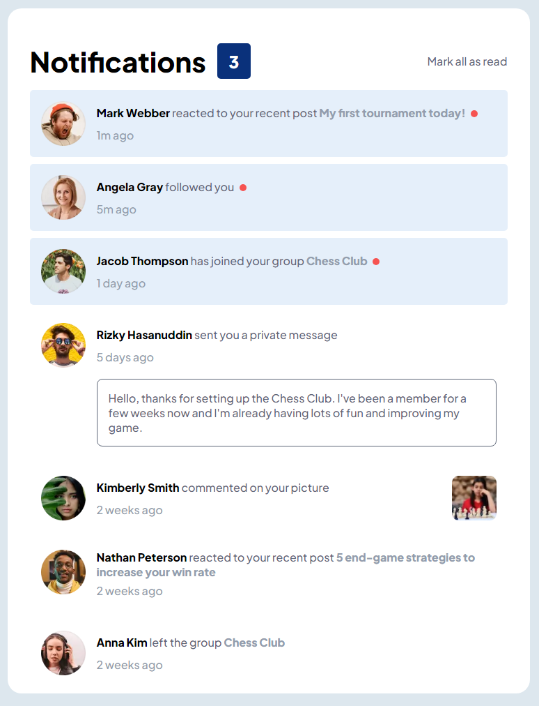

# Frontend Mentor - Notifications page solution

This is a solution to the [Notifications page challenge on Frontend Mentor](https://www.frontendmentor.io/challenges/notifications-page-DqK5QAmKbC). Frontend Mentor challenges help you improve your coding skills by building realistic projects.

## Table of contents

- [Overview](#overview)
  - [The challenge](#the-challenge)
  - [Screenshot](#screenshot)
  - [Links](#links)
- [My process](#my-process)
  - [Built with](#built-with)
  - [What I learned](#what-i-learned)
  - [Useful resources](#useful-resources)
- [Author](#author)

## Overview

### The challenge

Users should be able to:

- Distinguish between "unread" and "read" notifications
- Select "Mark all as read" to toggle the visual state of the unread notifications and set the number of unread messages to zero
- View the optimal layout for the interface depending on their device's screen size
- See hover and focus states for all interactive elements on the page

### Screenshot

### Links

- Github URL: [Github URL](https://github.com/exchyphen/fm_notifications-page)
- Live Site URL: [live site hosted by Github Pages](https://exchyphen.github.io/fm_notifications-page/)

## My process

### Built with

- HTML
- CSS
- JavaScript
- React

### What I learned

Lots of practice positioning elements.
More practice with React and creating meaningful components and useState, useEffect hooks.

### Useful resources

- [tabindex Property](https://developer.mozilla.org/en-US/docs/Web/HTML/Global_attributes/tabindex) - Learned I can use tabindex to make sure an element is accessible via "tab" on keyboard.

## Author

- Github - [exchyphen](https://github.com/exchyphen)
- Frontend Mentor - [@exchyphen](https://www.frontendmentor.io/profile/exchyphen)
